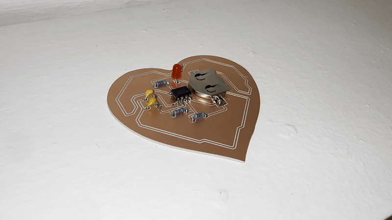

# Heartbeat

Heartbeat is a piece of art created by me for Creative Embedded Systems, a class at Columbia University. It is an etched PCB with a few basic soldered components, which make an LED blink. The PCB is heart-shaped, and the traces on the board trace the shape of a heart as well.

By following this guide, you will able to recreate this piece with just a few cheap parts, the necessary equipment, and some basic soldering abilities.

## Components
The piece consists of the following parts, which you'll need to recreate this piece.
- A copper clad board
- Three resistors (470R, 4.7k and 68k)
- Two capacitors (10n and 4.7u)
- A (red) LED
- A 555 timing chip (specifically a TI TLC555CP)
- A battery holder (specifically one with the form factor of a TE Connectivity BAT-HLD-003-SMT)
- A battery (CR2032, 3V)

## Guide
If you have never milled a copper clad board or need a primer on KiCad, you should follow a more extensive guide: [here](https://www.instructables.com/Milling-Printed-Circuit-Boards-PCBs-on-a-Cheap-CNC/) is an example, though the exact steps would depend on the hardware you have access to.

I will be using KiCad in this guide, but other programs should work as well.

If you do not wish to make any changes, you can skip steps 1.-3., and simply use the .svg files directly.

1. After cloning this repo, open the schematic/PCB files in KiCad, and make any edits you might wish to make. If you choose to use differently shaped components from me, you'll have to make the necessary changes here.
2. If you made edits, re-export the Gerber files for the layers F_Cu and Edge_Cuts. Also export Drill Files (Excellon format).
3. If your CNC requires .svg files, use the provided pcb_to_easel.sh file (by Miles Scharff) (after changing the GERBER_DIR parameter)
4. Use the generated files to carve your copper clad board. Use a guide specific to your CNC router for this! Note that if you used my SVGs, I have made the outline a bit to small to comfortably fit everything. Scale it up by around 1.1-1.2x.
5. Figure out the appropriate resistance and capacitor values. Feel free to use my values to get it to blink every 459ms, or change them using a calculator like [this](https://www.allaboutcircuits.com/tools/555-timer-astable-circuit/).
6. After selecting your parts, solder them to the PCB
7. Done! You'll have recreated this piece!
